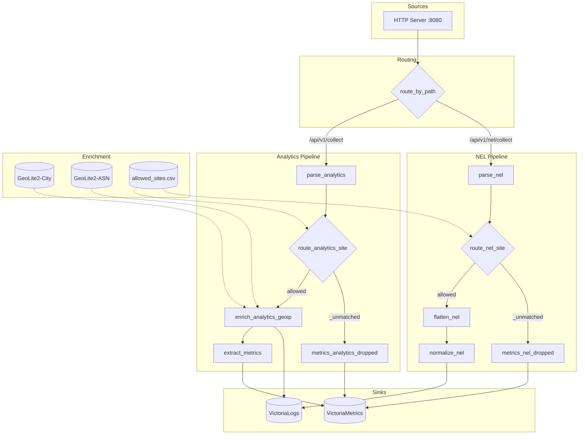

# Vector Pipeline

Vector.dev handles data ingestion, transformation, and routing for WireAnalytics.

## Data Flow



## Components

### Sources

| Component | Type | Description |
|-----------|------|-------------|
| `http_source` | http_server | Listens on port 8080 for POST requests |

### Enrichment Tables

| Table | Type | Description |
|-------|------|-------------|
| `geoip_city` | mmdb | MaxMind GeoLite2-City database |
| `geoip_asn` | mmdb | MaxMind GeoLite2-ASN database |
| `allowed_sites` | csv | Whitelist of allowed site IDs |

### Transforms

#### Analytics Pipeline

| Transform | Type | Description |
|-----------|------|-------------|
| `route_by_path` | route | Routes requests by URL path |
| `parse_analytics` | remap | Parses JSON payload, adds metadata |
| `route_analytics_site` | route | Filters by allowed sites |
| `enrich_analytics_geoip` | remap | Adds geographic data from IP |
| `extract_metrics` | remap | Extracts metric tags |
| `metrics_analytics_dropped` | log_to_metric | Counts dropped events |

#### NEL Pipeline

| Transform | Type | Description |
|-----------|------|-------------|
| `parse_nel` | remap | Parses NEL report array |
| `route_nel_site` | route | Filters by allowed sites |
| `flatten_nel` | remap | Unnests reports array |
| `normalize_nel` | remap | Flattens report structure |
| `metrics_nel_dropped` | log_to_metric | Counts dropped events |

### Sinks

| Sink | Type | Description |
|------|------|-------------|
| `victorialogs` | http | Sends logs to VictoriaLogs |
| `victoriametrics` | prometheus_remote_write | Sends metrics to VictoriaMetrics |

## Endpoints

| Path | Description |
|------|-------------|
| `POST /api/v1/collect` | Web analytics events |
| `POST /api/v1/nel/collect` | NEL reports |

## GeoIP Enrichment

The pipeline enriches analytics events with geographic data:

| Field | Source | Description |
|-------|--------|-------------|
| `geo.country_code` | City DB | ISO country code |
| `geo.country_name` | City DB | Country name |
| `geo.city` | City DB | City name |
| `geo.region` | City DB | Region/state name |
| `geo.region_code` | City DB | Region/state code |
| `geo.postal_code` | City DB | Postal code |
| `geo.latitude` | City DB | Latitude |
| `geo.longitude` | City DB | Longitude |
| `geo.timezone` | City DB | Timezone |
| `geo.asn` | ASN DB | Autonomous system number |
| `geo.as_org` | ASN DB | AS organization name |

## Site Filtering

Events are filtered against `allowed_sites.csv`:

```csv
site_id
example.com
app.example.com
```

Events from unlisted sites are dropped and counted in `wa_events_dropped_total` metric.

## Metrics

| Metric | Labels | Description |
|--------|--------|-------------|
| `wa_events_dropped_total` | `site_id`, `log_class` | Counter of dropped events |

## File Locations

| File | Container Path | Description |
|------|----------------|-------------|
| `vector.yaml` | `/etc/vector/vector.yaml` | Main configuration |
| `allowed_sites.csv` | `/etc/vector/allowed_sites.csv` | Site whitelist |
| `GeoLite2-City.mmdb` | `/etc/vector/geoip/GeoLite2-City.mmdb` | City database |
| `GeoLite2-ASN.mmdb` | `/etc/vector/geoip/GeoLite2-ASN.mmdb` | ASN database |
